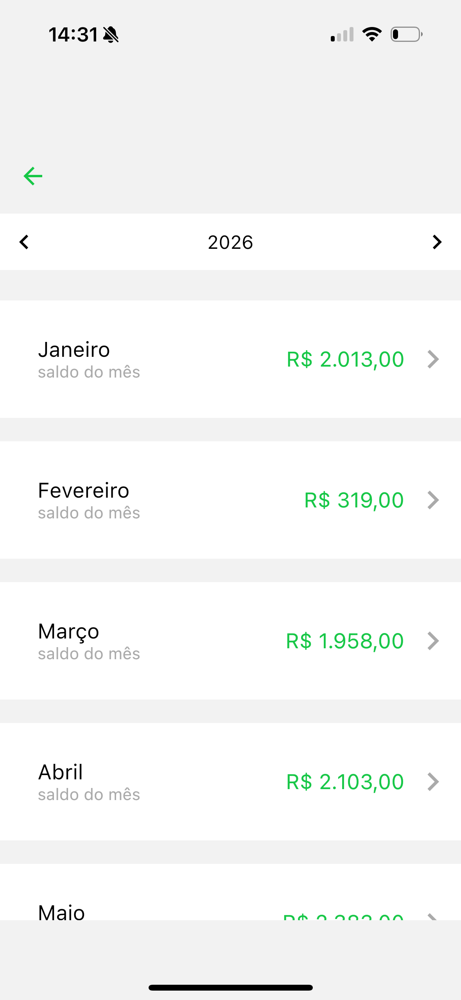
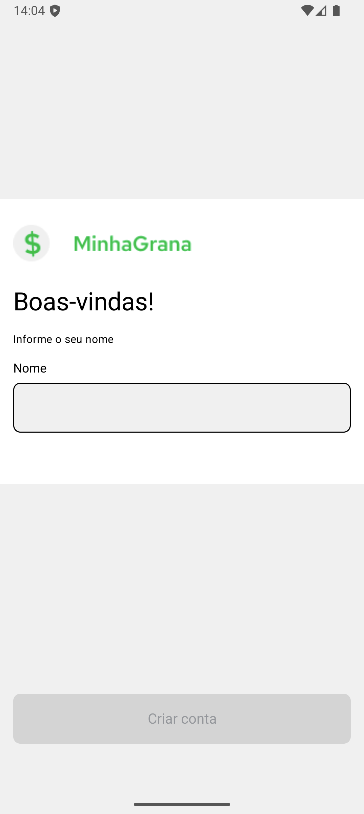
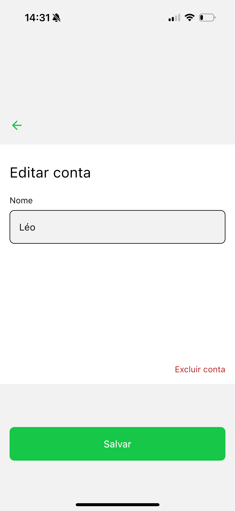
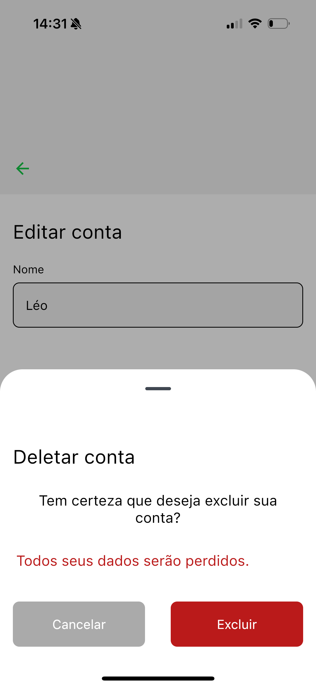

# Minha Grana

A personal finance app built with **Kotlin Multiplatform**, using Compose Multiplatform for the UI, running on **Android** and **iOS**.

## Overview

The app allows users to record entries (income and expenses) by category, view balances by month/year, and track a summary on the home screen with a pie chart by category. Data is stored locally in SQLite (SQLDelight), with shared repositories and ViewModels.

---

## Screens

### Home

| Android | iOS |
| --- | --- |
|  |  |

### New Entry

| Android | iOS |
| --- | --- |
|  |  |

### Entries

| Android | iOS |
| --- | --- |
|  |  |

### Entry (Edit)

| Android | iOS |
| --- | --- |
|  |  |

### Annual Balance

| Android | iOS |
| --- | --- |
|  |  |

### Navigation

| Android | iOS |
| --- | --- |
|  |  |
|  |  |
|  |  |


---

## Figma

<a href="https://www.figma.com/design/lBwuoc1jUqLHZgJ75wLBuG/minha-grana?m=auto&t=pOHWyosJFd6sjFze-1" target="_blank" rel="noopener noreferrer">Figma file</a>

---

## Stack

- **Kotlin Multiplatform** + **Compose Multiplatform** (Material 3)
- **SQLDelight** – local SQLite database with type-safe queries
- **Koin** – dependency injection (commonMain, Android, iOS)
- **Kotlinx Serialization** – serializable routes and models
- **Navigation Compose** – typed route navigation

## Project Structure

- **[composeApp](./composeApp)** – shared KMP module:
  - **commonMain** – logic, UI, DB, repositories, ViewModels, themes
  - **androidMain** – `MainActivity`, SQLDelight Android driver, `CurrentTime`, Android DI
  - **iosMain** – `MainViewController`, SQLDelight iOS driver, `CurrentTime`, iOS DI
- **[iosApp](./iosApp)** – iOS app (entry point and Compose integration)

### Main Packages (commonMain)


### Database (SQLDelight)

Schema at `composeApp/src/commonMain/sqldelight/com/minhagrana/database/MinhaGranaDatabase.sq`:

- **UserEntity**
- **CategoryEntity**
- **YearEntity** 
- **MonthEntity** 
- **EntryEntity** 

Accessed via `DatabaseHelper` and repositories; initialization (default user/year/months, categories) handled by `DatabaseInitializer`.

## Build and Run

### Android

```bash
./gradlew :composeApp:assembleDebug
```

Use the Android Studio run configuration.

### iOS

Open the [iosApp](./iosApp) folder in Xcode and run.

---

